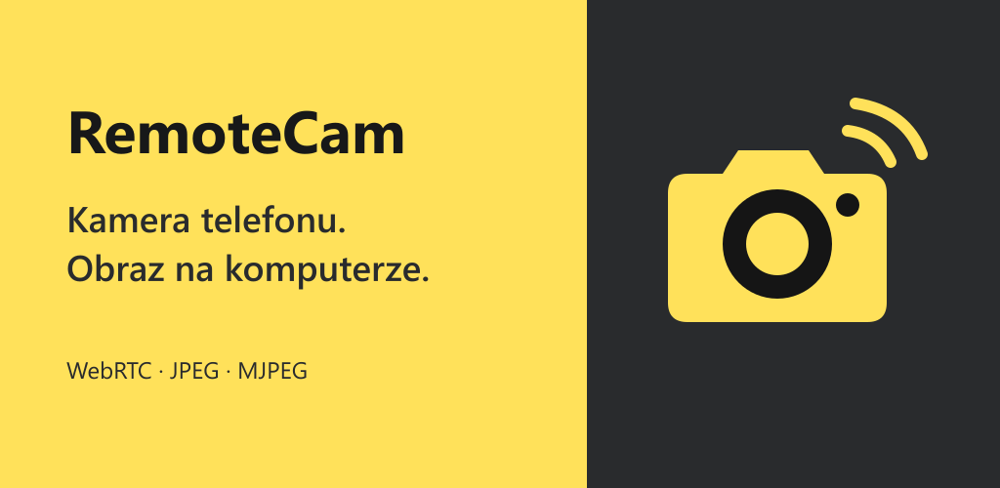
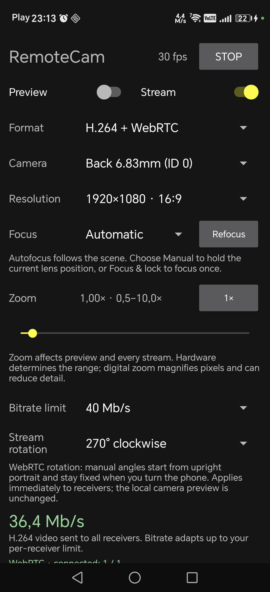
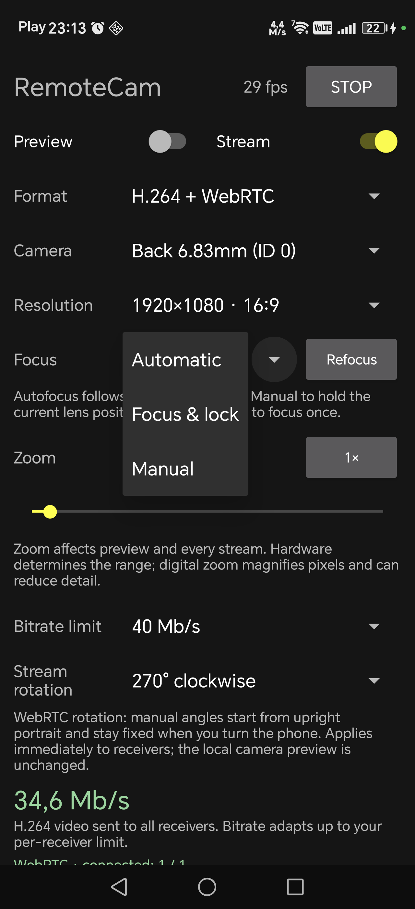
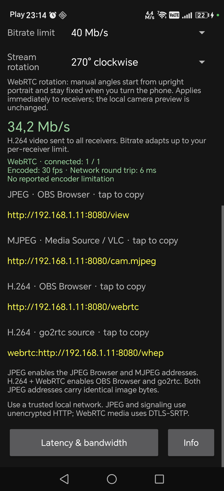
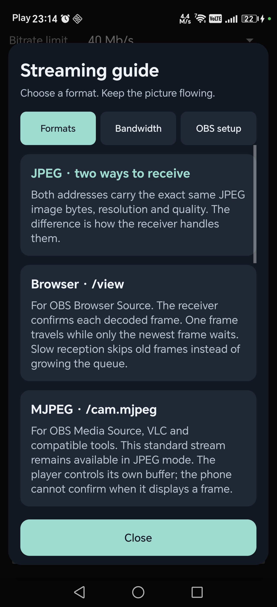

# RemoteCam

<p align="center">
  
</p>

**Your Android camera on your computer. Free, without ads or paid feature unlocks. Open source under the MIT license.**

[**Download test APK 0.3.2**](https://github.com/Desseres/RemoteCam/releases/download/v0.3.2/RemoteCam-0.3.2.apk)
· [Release notes & checksums](https://github.com/Desseres/RemoteCam/releases/tag/v0.3.2)
· [Website (PL / EN)](https://remotecam.kasztelan.me/)
· [Report an issue](https://github.com/Desseres/RemoteCam/issues)

RemoteCam streams your phone's camera over your local network so you can use it
in OBS or another compatible viewer. This fork brings the original application
up to date with modern Android SDKs, build tools and libraries while keeping its
simple purpose and free, ad-free approach.

In a world full of ads, subscriptions and paywalls, we want this project to
remain freely available to everyone. Download the source, build it, use it and
make it your own. Contributions and improvements are welcome.

## Install the test version

**0.3.2 is a public prerelease for testing**, distributed as a signed release APK
(about 61 MiB). It requires **Android 9 or newer**. You can install it directly;
Android Studio and a computer are not required for installation.

1. On your phone, [download RemoteCam-0.3.2.apk](https://github.com/Desseres/RemoteCam/releases/download/v0.3.2/RemoteCam-0.3.2.apk).
2. Open the downloaded file. If Android asks, allow **Install unknown apps** for
   the browser or file manager you used, then complete installation.
3. Connect the phone and computer to the same trusted local network. Open
   RemoteCam and grant camera access (and local network access if requested).
4. Choose **H.264 + WebRTC** and enable **Stream**. Open the app's WebRTC browser
   address on your computer, or add it as an OBS **Browser Source**.
5. For phone audio, enable **Microphone audio**, grant microphone access and
   enable sound in the receiver. In OBS, select **Control audio via OBS**.

JPEG Browser and MJPEG are also available for video-only receivers. See
[OBS setup](#use-with-obs) and the [audio guide](docs/webrtc-audio.md) for details.

Updating release 0.3.1 with the same `pl.remotecam.app` package and signing key
preserves settings. A debug build with that package has a different signature;
switching to release requires uninstalling it, which deletes its settings.
Older packages with a different application ID install alongside this version.

This build has been tested on an Android 16 phone; wider device coverage,
locked-screen / Standby behavior and end-to-end audio sync still need testing.
Please [report your results](https://github.com/Desseres/RemoteCam/issues), including
phone model, Android version, stream format, receiver and steps to reproduce.

## See what changed

The original camera streamer now has camera and format selection, focus and zoom
controls, copyable receiver addresses and a built-in streaming guide.
These are real screenshots from the project. The modernization screenshots were
taken before the 0.3.2 microphone controls were added, so those controls are not
shown here. Click any screenshot to open it at full size.

| Original interface | Modernized camera controls |
| :---: | :---: |
| <a href="assets/screen.jpg"></a> | <a href="store/google-play/screenshots/01-camera-controls.png"></a> |
| Camera preview and basic JPEG streaming. | More camera controls, hardware H.264 streaming and independent preview. |

| Focus & zoom | Receiver addresses | In-app guide |
| :---: | :---: | :---: |
| <a href="store/google-play/screenshots/02-focus-options.png"></a> | <a href="store/google-play/screenshots/03-receiver-addresses.png"></a> | <a href="store/google-play/screenshots/04-streaming-guide.png"></a> |
| Choose automatic focus, lock it or adjust it manually when supported. | Copy the right address for your browser, OBS or go2rtc. | Find format explanations, bandwidth guidance and OBS instructions. |

**New in 0.3.2:** optional phone microphone audio over WebRTC, a separate mute
control and audio playback in browsers, OBS and go2rtc. Audio starts disabled;
JPEG and MJPEG remain video only.

## Project resources

Google Play preparation (listing, graphics, privacy policy and submission checklist):
[Play Console publication pack](store/google-play/PLAY-CONSOLE.md).
This is a preparation package; the app has not been published to Google Play.

Website sources and the hosting update script are in `website/` and
`scripts/publish-site.ps1`. See the [website deployment guide](docs/website.md).

## Thanks to the original author

Thank you to **Thomas SIMON ([Ruddle](https://github.com/Ruddle))**, the author of
the [original RemoteCam](https://github.com/Ruddle/RemoteCam), for the application,
the inspiration and the decision to share it as free, open-source software.
This project builds on that work and carries its spirit forward with an updated
Android implementation.

## Updated for modern Android

The published test version is **0.3.2**. This development checkout is
**0.3.3-h265.1**, adding an optional **H.265 + WebRTC (test)** format. The 0.3.2
download above does not include H.265. See the [HEVC testing guide](docs/h265-testing.md)
for building, compatibility checks and the remaining device tests.

The modernized application includes:

- **Android 17 / API 37** compile and target SDK, with Android 9 / API 28 as the minimum.
- Updated build tools: **Android Gradle Plugin 9.4.0**, **Gradle 9.7.1** and Java 17 bytecode.
- Updated AndroidX libraries, Kotlin coroutines and **Ktor 3.5.2**.
- Camera foreground service and permission handling for modern Android versions.
- Camera and resolution selection, aspect-ratio labels and adjustable JPEG quality.
- Camera-supported zoom, autofocus lock and manual focus, saved separately for each camera.
- Saved camera, resolution, quality, Preview and Stream settings between launches.
- Toggle Preview without restarting an active stream; hiding it gives settings the full screen.
- A browser receiver that skips stale frames to limit accumulated delay.
- Optional hardware **H.264 + WebRTC** streaming, with an adjustable bitrate limit.
- Optional **Opus microphone audio** over WebRTC, with saved audio and mute settings.
- Direct go2rtc input via HTTP/SDP at `/whep`, alongside the existing browser player.
- Saved stream rotation for all three addresses: automatic or fixed 0°, 90°, 180° and 270° clockwise.
- Separate, copyable JPEG Browser, MJPEG and WebRTC addresses.
- Bandwidth in **Mb/s**, receiver feedback colors and a bandwidth planning table.
- A redesigned in-app guide with tabs, readable cards, tables and OBS setup steps.
- Bottom-of-screen guide and Info buttons; original author credits and project details in Info.

Tested on a physical **Android 16** phone. Android 17 is the build target;
runtime behavior on Android 17 and other devices still needs testing.
See the [modernization and validation report](docs/modernization.md) for details.

## Build and test

Get the source:

```sh
git clone https://github.com/Desseres/RemoteCam.git
cd RemoteCam
```

Install JDK 17+ and Android SDK Platform 37.0; set `ANDROID_HOME`.

```sh
./gradlew :app:assembleDebug :app:testDebugUnitTest :app:lintDebug
```

On Windows, especially with non-ASCII characters in the account/project path:

```powershell
.\tools\build-windows.ps1
```

The helper creates checked directory junctions under `C:\Temp\RemoteCamBuild`
to avoid Java socket and Gradle worker encoding problems. It changes no global
settings and does not move the repository. Use `-BuildRoot` to choose another
ASCII path if that directory is already used by another checkout.

Build and install your own development version using Android Studio or Android
SDK tools. For a signed APK suitable for a GitHub Release, see the
[release packaging and signing guide](docs/releases.md) and
[0.3.2 release notes](docs/releases/v0.3.2.md).

## Use with OBS

### go2rtc input

Download go2rtc from its [official releases](https://github.com/AlexxIT/go2rtc/releases/).
See the **[setup guide with examples (Polski)](docs/go2rtc.md)** for Windows setup,
OBS Browser/RTSP sources, multiple phones and troubleshooting, or start with the
[example go2rtc.yaml](examples/go2rtc.yaml).

For freezes after packet loss in go2rtc 1.9.14, see the
[local NACK retransmission fix and regression test](patches/README.md).
This fixes the relay executable without changing camera quality or adding a
playback buffer; it is a local patch, not an official go2rtc release.

Select **H.264 + WebRTC** and enable **Stream** on the phone. For go2rtc, use the
separate source address shown in the application, including the `webrtc:` prefix:

```yaml
streams:
  H6:
    - webrtc:http://192.168.1.11:8080/whep
```

Replace the IP with your phone's address. `/webrtc` serves an HTML browser player;
giving that URL directly to go2rtc produces `magic: unsupported header: 3c21646f`
because the response starts with `<!do` from the HTML doctype.

The `/whep` endpoint uses the complete HTTP/SDP exchange supported by
[go2rtc's WebRTC client](https://github.com/AlexxIT/go2rtc/blob/master/internal/webrtc/README.md#whep).
It supports POST with gathered ICE candidates and DELETE at the returned session
Location. Trickle ICE/PATCH and ICE restarts are not implemented; reconnect to
create a new session. Starting with 0.3.2, optional receive-only audio offers receive
Opus when Microphone audio is enabled on the phone; otherwise audio stays inactive.
Existing `/webrtc`, `/view` and `/cam.mjpeg`
addresses keep their previous roles.
The hardware encoder is asked for a keyframe about every two seconds so that
MP4/MSE viewers joining an existing relay stream can start decoding without
waiting for another WebRTC receiver to request one. The bitrate limit still applies.

### Direct OBS sources

Open RemoteCam, grant camera access (and local network access on Android 17),
choose a **Format**, then enable **Stream**:

| Format | Address | OBS source |
| --- | --- | --- |
| JPEG | `http://PHONE_IP:8080/view` | Browser Source with receiver feedback |
| JPEG | `http://PHONE_IP:8080/cam.mjpeg` | Media Source; start with Network Buffering at 0 MB |
| H.264 + WebRTC | `http://PHONE_IP:8080/webrtc` | Browser Source |

For Browser Source, set custom FPS to 30 and use dimensions matching the displayed
image. WebRTC corrects the Camera2 texture rotation and front-camera mirror,
then reports orientation to the receiver. With the phone upright in portrait,
1920×1080 capture is displayed as 1080×1920: use those portrait dimensions for
the OBS source, or keep 1920×1080 to show the entire portrait picture with side bars.
Fit the source proportionally instead of stretching it. Set rotation in the app;
do not apply the same rotation again in OBS. Close the previous camera source to avoid duplicate traffic. The two
JPEG addresses carry identical JPEG image bytes; only the transport and receiver
buffering differ. Switching to WebRTC activates its separate endpoint; JPEG mode
retains both existing endpoints and all its original camera/quality controls.

In either format, **Stream rotation** changes orientation without restarting
the stream. **Automatic** follows display orientation. Manual angles
are clockwise from upright portrait and ignore subsequent display rotation;
0°/180° retain portrait framing and 90°/270° turn it sideways. This changes
orientation, not the field of view, and does not stretch the image or rotate the
local camera preview. The choice is saved across app restarts. WebRTC carries the
rotation in frame metadata, which its browser receiver applies automatically.

For JPEG Browser and MJPEG, the app requests Camera2 JPEG orientation and sends
physically oriented pixels to both endpoints. If the camera rotates the pixels,
its original JPEG is passed through. If it only supplies EXIF orientation, the
app decodes, rotates and re-encodes at quality 100 without resizing. This fallback
is not lossless: it can increase CPU use, bandwidth and frame time. Actual FPS
and bandwidth are reported for the resulting frames. Both JPEG receivers still
receive the same bytes and need no EXIF rotation support. The previous WebRTC-only
rotation preference is migrated automatically to the shared setting.

**Preview** is independent of streaming;
**Stop** in the app or notification releases the camera and server.
Camera, format, resolution, JPEG quality, WebRTC bitrate limit, Preview and Stream are saved on the phone and
restored when you next open the app, including after an app update. Uninstalling
the app or clearing its storage deletes these settings. If the saved camera or
resolution is no longer available, RemoteCam selects a supported fallback.

### Focus and zoom

**Automatic** follows the scene when continuous autofocus is supported.
**Focus & lock** performs one autofocus operation and holds its result; **Refocus**
starts a new operation. The status distinguishes successful focus from a failed
focus lock. Reopening the camera with this mode selected focuses again.

**Manual**, when supported, starts at the reported lens position so you can hold
the existing focus or adjust it with the far-to-near slider. Its saved position
is restored after reopening the camera. Approximate distance labels are shown
only for cameras reporting calibrated or approximately calibrated units;
uncalibrated lenses show position instead. Fixed-focus cameras hide these controls.

The **Zoom** slider uses the camera's supported range, with a **1×** reset. Android
11+ uses Camera2 zoom ratio when available; older cameras use a centered sensor
crop. Lens hardware determines whether magnification involves optical changes or
digital cropping, and digital zoom can reduce detail. Focus and zoom apply to the
local preview, both JPEG endpoints and WebRTC without reconnecting the receiver.
Settings are remembered separately for each camera. If a nearby object cannot be
brought into focus, move it farther from the lens; zoom cannot overcome the lens's
minimum focusing distance.

Validate the live stream without saving images (Python 3.9+):

```sh
python tools/check_stream.py http://PHONE_IP:8080/cam.mjpeg --frames 60 --clients 2
```

Use a trusted local network. JPEG and WebRTC signaling use unauthenticated,
unencrypted HTTP/WebSocket connections. WebRTC media uses DTLS-SRTP. This first
WebRTC implementation connects directly on the LAN, without public STUN/TURN
servers. Version 0.3.2 adds optional phone microphone audio over WebRTC; JPEG/MJPEG
remain video only. See [WebRTC audio](docs/webrtc-audio.md) for permissions, mute,
OBS/go2rtc setup and testing. A separate PC microphone still needs its own OBS sync offset.

### Latency and bandwidth

**JPEG mode** streams independent JPEG frames through either `/view` or
`/cam.mjpeg`. **H.264 + WebRTC mode** sends camera textures directly to a hardware
H.264 encoder, without an intermediate JPEG conversion. Development builds also
offer **H.265 + WebRTC (test)** through the same hardware capture path, using
`/webrtc` and `/whep`. It requires a compatible hardware HEVC encoder and receiver;
there is no silent fallback to H.264. JPEG/MJPEG remain separate video-only modes.

WebRTC offers resolutions supported by both the selected camera and a hardware
H.264 encoder at 30 fps. Its bitrate limit is adjustable from 2 to 40 Mb/s per
receiver; actual bitrate adapts to conditions. The sender is configured to maintain
resolution and may lower FPS when constrained. The limit is not a guarantee of
constant image quality. Each receiver uses encoding resources and bandwidth;
up to four signaling sessions are allowed, subject to device encoder capacity.

WebRTC feedback shows actual video output, encoded FPS, network round-trip time
and reported encoder limitations. These are not end-to-end latency measurements.
Add `?stats=1` to `/webrtc` for optional browser-side codec, frame rate, bitrate
and average jitter-buffer diagnostics. The in-app guide has separate **Formats**,
**Bandwidth** and **OBS setup** tabs, with copy buttons for all three addresses.

The displayed camera rate uses decimal **Mb/s** (megabits per second). The old
counter was **kB/s** (kilobytes per second): 16,000 kB/s equals 128 Mb/s.
Camera production and total receiver output are displayed separately.
**Latency & bandwidth** opens a table calculated from the current resolution,
JPEG quality and measured average frame size. The suggested 2× capacity is a
planning allowance for variation, not a measured LAN speed or a guarantee.

`/view` decodes the transmitted JPEG bytes into a canvas and acknowledges each draw.
The server permits one frame in flight and retains only the latest waiting frame
per receiver. A slow receiver skips stale frames without changing JPEG quality or
resolution. Green/orange/red feedback uses recent acknowledgement cycles and
skipped frames; gray means insufficient feedback, including legacy MJPEG clients.
This does not measure total camera-to-OBS latency. Legacy MJPEG clients may still
buffer internally; a successful socket write cannot confirm playback.

A larger buffer increases delay and cannot fix a sustained bandwidth shortage.
Prefer Ethernet for the PC and a strong 5/6 GHz Wi-Fi connection for the phone.
For a separate PC microphone, record a clap test in OBS. If sound consistently
precedes the image, apply that measured positive Sync Offset to the microphone
in Advanced Audio Properties. Fix variable video delay before setting an offset.

## License

RemoteCam remains open source under the **[MIT License](LICENSE)**. The original
author's copyright and license notice are preserved.

The bundled [WebRTC SDK](https://github.com/webrtc-sdk/android) is version
**150.7871.01**. Its [SDK license](app/src/main/resources/licenses/WEBRTC-SDK.txt)
and [WebRTC/third-party notices](app/src/main/resources/licenses/WEBRTC.md) are
included with the app and also served at `http://PHONE_IP:8080/licenses`.

You are welcome to download, use, modify and share the project under those terms.
This fork remains free, without ads, subscriptions or paid feature unlocks.

The original author also asked that the app not be uploaded to the Play Store.
Please respect that request.
